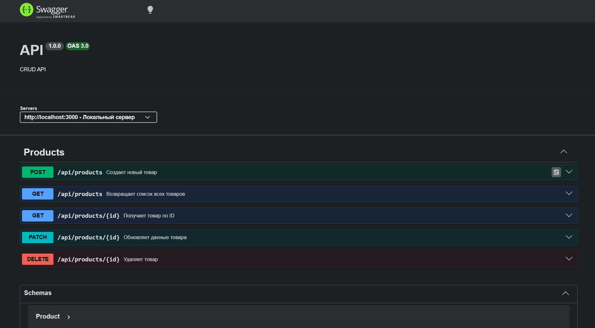
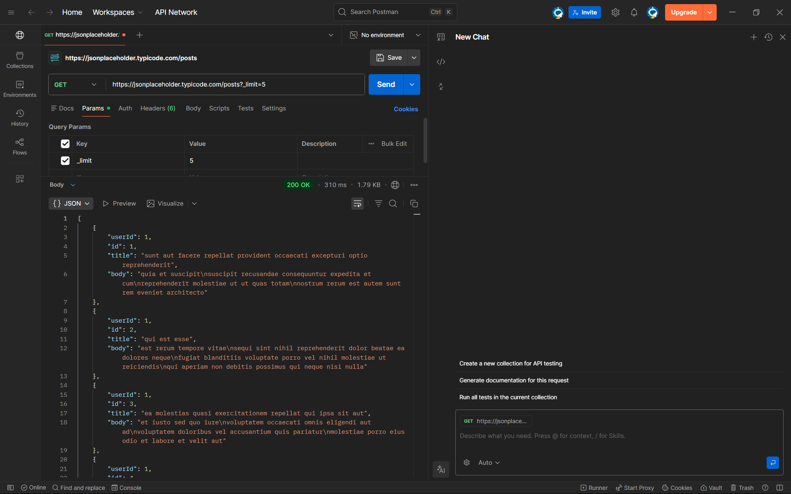

# REST API для управления товарами интернет‑магазина

Было реализовано и протестированною полнофункциональное REST API приложение для управления товарами интернет‑магазина.

## Endpoints
- `POST /api/products` — создать товар
- `GET /api/products` — получить список товаров
- `GET /api/products/:id` — получить товар по `id`
- `PATCH /api/products/:id` — обновить товар по `id`
- `DELETE /api/products/:id` — удалить товар по `id`
- `GET /api-docs` — Swagger UI (документация API)
##

